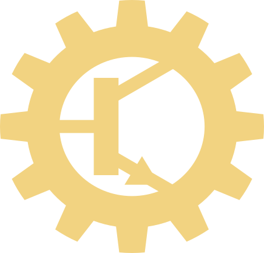
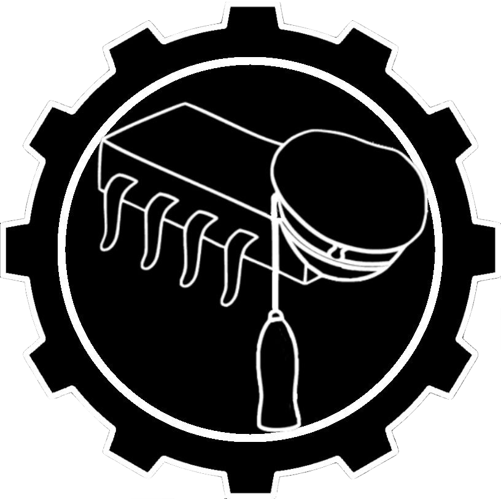

# Datateknologernas utmärkelsereglemente

*(Antaget på medlemsmötet 8.4.2022)*

## Kapitel I - Allmänna bestämmelser

#### § 1 Dokumentets omfattning

Detta dokument reglerar utmärkelser för Datateknologerna vid Åbo Akademi rf i enlighet med föreningens stadgar kapitel VII paragraf 22.

## Kapitel II Föreningens utmärkelser

#### § 2 Halvledarmedaljen

Halvledarmedaljen tilldelas en dateit som haft en viktig roll inom DaTes verksamhet. En dateit som på eget initiativ eller med förtroendeuppdrag, under eller efter sin studietid, ställt upp och entusiastiskt arbetat för DaTe.

Halvledarmedaljen instiftades år 2018 av Deprecated, en grupp äldre teknologer och alumner. Medaljens mottagare bestäms och delas ut årligen på föreningens årsfest av Deprecated i samråd med styrelsen. Meningen med medaljen är att uppmuntra alla dateiter, också de som inte har förtroendeuppdrag, att vara aktiva inom föreningen. Medaljen kan under samma år delas ut i flera exemplar. Medaljörer inbjudes att bli medlemmar i Deprecated för att delta i arbetsgruppen som utsätter medaljen.

*Symbolen på Halvledarmedaljens åtsida visas normalt här.*

#### § 3 Hedersmedlemspin

I enlighet med föreningens stadgar, kapitel II, paragraf 5, kan föreningen anta hedersmedlemmar. Utöver kallelsen tilldelas hedersmedlemmar vid föreningens följande jubileumsårsfest en utmärkelse i form av en hedersmedlemspin. Denna pin består av Albin omringad av ett kugghjul. Endast personer utnämnda till hedersmedlemmar i föreningen äger rätten att bära denna pin.

